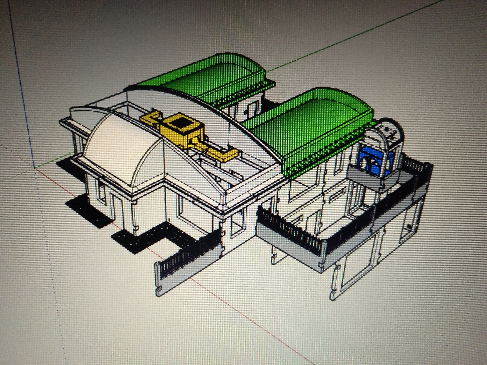
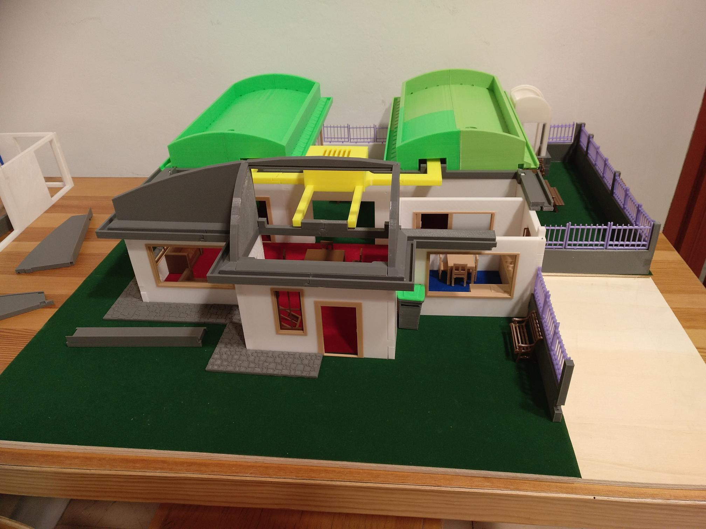

# Casa Domòtica Educativa

Casa Domòtica Educativa en construcció 

Realitzada per [Jordi Mayné](https://github.com/maynej) des de Mechatronic Study 

L'objectiu es construir un parc mediambiental educatiu on estiguin representats espais del nostre entorn on vivim, arbres, hort, riu... i una casa sostenible aplicant la domòtica, gestionant el medi ambient i mesurant paràmetres de la natura.

En aquest Github mostraré només la Casa domòtica

Tota la [documentació es pot trobar en PDF](https://github.com/maynej/Smart-Home/tree/main/DOC).

STL per imprimir [aquí](https://github.com/maynej/Smart-Home/tree/main/STL_SMARTHOME).

## Casa 3D (EN CONSTRUCCIO !!)
  
Descripció         | Imatge          | Arxiu         
------------- | ------------- | ------------- 

EN CONSTRUCCIO !!

## Llicència

Creative Commons Attribution-NoComercial-ShareAlike 4.0 International (CC BY-NC-SA 4.0)  

