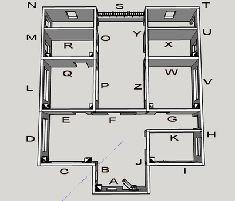
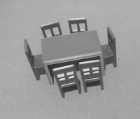

# Casa Domòtica Educativa

Casa Domòtica Educativa en construcció 

Realitzada per [Jordi Mayné](https://github.com/maynej) des de Mechatronic Study 

L'objectiu es construir un parc mediambiental educatiu on estiguin representats espais del nostre entorn on vivim, arbres, hort, riu... i una casa sostenible aplicant la domòtica, gestionant el medi ambient i mesurant paràmetres de la natura.

Tota la [documentació es pot trobar en PDF](https://github.com/maynej/Smart-Home/tree/main/DOC). També en llengua castellana.

Un vídeo del muntatge de l'estructura de la casa el podreu trobar en la carpeta [Vídeos](https://github.com/maynej/Smart-Home/tree/main/Videos)

STL per imprimir [aquí](https://github.com/maynej/Smart-Home/tree/main/STL_SMARTHOME).

## Casa 3D 
  
Descripció         | Imatge          | Arxiu         
------------- | ------------- | ------------- 
Parets | | [Parets](STL_SMARTHOME/Casa/Parets)
Finestres | | [Finestres](STL_SMARTHOME/Casa/Finestres)
Portes | | [Portes](STL_SMARTHOME/Casa/Portes)
Ascensor | | [Ascensor](STL_SMARTHOME/Casa/Ascensor)
Teulades | | [Teulades](STL_SMARTHOME/Casa/Teulada)
Voreres | | [Voreres](STL_SMARTHOME/Casa/Vorera)
Aire Condicionat | | [Aire Condicionat](STL_SMARTHOME/Casa/AireCondicionat)
Pati | | [Pati](STL_SMARTHOME/Casa/Pati)

## Garatge

Descripció         | Imatge          | Arxiu         
------------- | ------------- | ------------- 
Mobiliari | | [Mobiliari](STL_SMARTHOME/Casa/Mobiliari)

## Garatge

Descripció         | Imatge          | Arxiu         
------------- | ------------- | ------------- 
Garatge | | [Garatge](STL_SMARTHOME/Garatge)

## Jardi (en contrucciò)

Descripció         | Imatge          | Arxiu         
------------- | ------------- | ------------- 
Generador Eòlic | | [GeneradorEolic](STL_SMARTHOME/Jardi/GeneradorEolic)
Seguidor Solar | | [SeguidorSolar](STL_SMARTHOME/Jardi/SeguidorSolar)

Creative Commons Attribution-NoComercial-ShareAlike 4.0 International (CC BY-NC-SA 4.0)  

## QR

 <a href="https://www.codigos-qr.com/en/qr-code-generator/" target="_blank" id"qrgenerator">Qr Code Generator</a>

